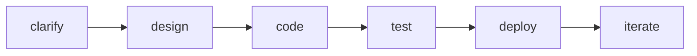

# AppForge run `4a9b6b809e4b4cad8b03a04e687c3b25`

**Status:** done  •  **Workers (PIDs):** [41556, 5908, 35144, 34280]

## Phases

| phase | status | gate |
|---|---|---|
| clarify | complete | approved |
| code | complete | none |
| deploy | complete | none |
| design | complete | approved |
| iterate | complete | none |
| test | complete | none |

## Tasks (agent → worker PID → model)

| agent | phase | status | worker | model |
|---|---|---|---|---|
| clarifying_pm | clarify | done | pid 41556 | claude-3-5-sonnet-20241022 |
| solution_architect | design | done | pid 41556 | claude-3-5-sonnet-20241022 |
| tech_lead | design | done | pid 41556 | gpt-4o |
| uiux_designer | design | done | pid 41556 | claude-3-5-sonnet-20241022 |
| database | code | done | pid 41556 | gpt-4o |
| backend | code | done | pid 41556 | claude-3-5-sonnet-20241022 |
| frontend | code | done | pid 41556 | claude-3-5-sonnet-20241022 |
| ai_ml | code | done | pid 35144 | claude-3-5-sonnet-20241022 |
| qa_test | test | done | pid 41556 | gpt-4o-mini |
| security | test | done | pid 41556 | claude-3-5-haiku-20241022 |
| devops | deploy | done | pid 41556 | gpt-4o-mini |
| technical_writer | deploy | done | pid 41556 | gpt-4o-mini |
| delivery_summarizer | iterate | done | pid 41556 | gpt-4o-mini |

## Phase dependency graph

