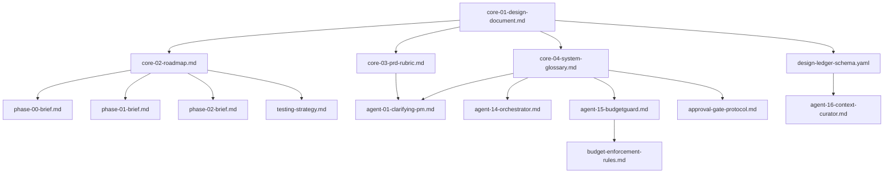

# DevTeam.AI Design Phase - Master Document List

## Document Structure Philosophy

**Three-Tier Hierarchy**:
1. **Core Design Documents** (4 docs) - The constitution. Never changes without major version bump.
2. **Phase Specifications** (15 docs) - Implementation briefs. Can be refined but maintain backward compatibility.
3. **Agent Specifications** (16 docs) - Behavior contracts. Hot-reloadable, versioned prompts reference these.

**Naming Convention**: `[tier]-[number]-[name].md`
- Tier: `core`, `phase`, `agent`
- Number: Two digits for sorting
- Name: Kebab-case descriptor

---

## TIER 1: Core Design Documents (Foundation)

### ✅ COMPLETED

#### `core-01-design-document.md`
**Status**: ✅ Complete (you provided this - CoreDesignDocument.md)
**Purpose**: Single source of truth for architecture, tech stack, and principles
**Key Sections**: 15 agents, tech stack table, modularity guarantees, delivery checklist
**References**: All other documents defer to this
**Maintenance**: Only update on major architecture changes (v1.0 → v2.0)

#### `core-02-roadmap.md`
**Status**: ✅ Complete (you provided this - Roadmap.md)
**Purpose**: 15-phase delivery timeline with testable milestones
**Key Sections**: Phase table, success criteria, testable deliverables
**References**: Each phase brief (`phase-XX-brief.md`) implements one row
**Maintenance**: Can add phases, never remove or reorder existing ones

---

### 🔄 IN PROGRESS

#### `core-03-prd-rubric.md`
**Status**: ✅ Complete (we just created this)
**Purpose**: Quality standard for Phase 3 output (PRD approval criteria)
**Key Sections**: 15 criteria, 4 red flags, PRD template, training examples
**References**: `agent-01-clarifying-pm.md` enforces this, `phase-03-brief.md` validates against it
**Maintenance**: Can add criteria, never relax required ones without version bump

---

### 📝 TO CREATE

#### `core-04-system-glossary.md`
**Status**: ❌ Not started
**Purpose**: Canonical definitions to prevent agent confusion
**Estimated Length**: 2,000-3,000 words
**Why Critical**: Prevents semantic drift (what does "done" mean? "approved"? "testable"?)

**Required Sections**:
1. **State Definitions**
   - What is "PRD approved"? (all checkboxes ticked + user confirmed)
   - What is "feature complete"? (acceptance criteria met + tests pass + docs written)
   - What is "deployment ready"? (security scan clean + performance benchmarks met + preview URL live)

2. **Role Definitions**
   - What can the Orchestrator decide vs. escalate?
   - When does BudgetGuard block vs. warn?
   - What decisions require human approval vs. proceed automatically?

3. **Artifact Standards**
   - PRD format (defined in core-03, referenced here)
   - ADR format (Solution Architect output)
   - Design JSON schema (UI/UX Designer output)
   - Test suite structure (QA Agent output)

4. **Command Vocabulary**
   - `/escalate` - freeze state, switch to strongest model or human
   - `/rollback` - revert to last checkpoint
   - `/continue` - resume after pause
   - `/status` - show current phase + budget + blockers

5. **Quality Thresholds**
   - "Testable" = can be verified by automated script in <5 seconds
   - "Clean" code = passes ruff + black + 80% test coverage + no security warnings
   - "Accessible" = WCAG 2.1 AA (Lighthouse score >90)
   - "Performant" = meets specific PRD benchmarks (no vague "fast")

**Success Criteria**: Every agent prompt can reference `{{glossary.feature_complete}}` and get the same definition.

---

## TIER 2: Phase Specifications (Implementation Briefs)

### ✅ COMPLETED

#### `phase-00-brief.md`
**Status**: ✅ Complete (you provided this - 00-brief.md)
**Purpose**: Bootstrap repo skeleton + CI + basic structure
**References**: `core-01` for folder structure, `core-04` for command vocabulary
**Deliverable**: 10-item checklist (all binary yes/no)

#### `phase-01-brief.md`
**Status**: ✅ Complete (you provided this - 01-brief.md)
**Purpose**: Minimal viable graph (blank cycle with state persistence)
**References**: `core-01` for LangGraph setup, `agent-14-orchestrator.md` for routing
**Deliverable**: 9-item checklist

---

### 📝 TO CREATE (Phases 2-14)

Each phase brief follows this template:

```markdown
# Phase [N] Brief - [Milestone Name]

## Purpose
[One sentence: what capability does this phase add?]

## Prerequisites
- Phase [N-1] checklist: ✅ All items complete
- Required agents: [List of agents that must be implemented]
- Required documents: [List of specs/prompts needed]

## Scope
[2-3 paragraphs: what's built, what's explicitly excluded]

## Required Changes
[Numbered list of files to create/modify with exact requirements]

## Success Criteria
[10-15 binary checkboxes - must be verifiable in <90 seconds]

## Human Approval Gate (if applicable)
[What the human reviews, what they're approving, how long it should take]

## Dependencies
[Which Phase [N+1] items are blocked until this completes?]

## Cost Estimate
[Expected LLM token spend: $X-Y based on complexity]

## Rollback Plan
[If this phase fails validation, what's the recovery path?]
```

#### Priority Order for Creation:

**High Priority** (blocking Phase 0-1 implementation):
1. ✅ `phase-00-brief.md` - Complete
2. ✅ `phase-01-brief.md` - Complete
3. ❌ `phase-02-brief.md` - **Agent Framework + BudgetGuard**
4. ❌ `phase-03-brief.md` - **Clarification Loop MVP**

**Medium Priority** (needed before Phase 6 app building):
5. ❌ `phase-04-brief.md` - Parallel Planning Sprint
6. ❌ `phase-05-brief.md` - Memory & Persistence
7. ❌ `phase-06-brief.md` - Specialist Agents Round 1

**Lower Priority** (can draft during Phases 0-5 execution):
8-14. `phase-07` through `phase-14-brief.md`

---

## TIER 3: Agent Specifications (Behavior Contracts)

Each agent needs a specification document that defines:
- Role & responsibilities
- Input requirements (what state it needs)
- Output format (what it produces)
- Decision authority (what it can decide vs. escalate)
- Handoff protocol (what it passes to next agent)
- Failure modes (how it handles errors)

### Template Structure:

```markdown
# Agent Specification - [Agent Name]

## Role Summary
[2-3 sentences: real-world equivalent, core responsibility]

## Authority Level
- **Can Decide Autonomously**: [List of decisions this agent makes without approval]
- **Must Escalate**: [List of decisions requiring human/Orchestrator approval]
- **Cannot Do**: [Explicit boundaries to prevent scope creep]

## Input Requirements
[TypedDict schema or JSON structure showing required state fields]

## Output Format
[Exact schema of what this agent produces]

## Handoff Protocol
**Receives From**: [Previous agent(s)]
**Delivers To**: [Next agent(s)]
**Triggers Approval Gate**: [Yes/No - when?]

## Success Criteria
[How does the agent know it's "done"?]

## Failure Modes & Recovery
1. **[Failure scenario]**: [How agent handles it]
2. **[Failure scenario]**: [How agent handles it]

## Prompt Template Reference
`prompts/v1/[agent-name].jinja`

## Cost Profile
- **Typical token usage**: [X input + Y output per invocation]
- **Estimated cost per run**: $X-Y
- **Optimization notes**: [Can this use a cheaper model? When?]

## Testing Strategy
[How to verify this agent works in isolation]
```

---

### 📝 AGENTS TO SPECIFY (Priority Order)

**CRITICAL PATH** (needed for Phases 0-3):

#### `agent-01-clarifying-pm.md`
**Status**: ❌ Not started
**Why Critical**: Phase 3 gate - if this fails, nothing downstream works
**Complexity**: HIGH (most complex prompt, enforces PRD rubric)
**Key Sections**:
- Question sequencing logic (6 questions, one topic per turn)
- Rubric self-scoring algorithm
- Red flag detection patterns
- PRD generation template

#### `agent-14-orchestrator.md`
**Status**: ❌ Not started
**Why Critical**: Phase 1 - the traffic controller for all other agents
**Complexity**: MEDIUM (routing logic must be bulletproof)
**Key Decisions**:
- LLM-based routing vs. rules-based FSM (start with former, migrate to latter)
- When does it invoke BudgetGuard vs. let agents proceed?
- How does it handle `/escalate` command?

#### `agent-15-budgetguard.md`
**Status**: ❌ Not started
**Why Critical**: Phase 2 - prevents runaway costs
**Complexity**: LOW (mostly arithmetic + model switching rules)
**Key Sections**:
- Budget tracking (per-phase, cumulative, projected)
- Auto-downgrade rules (at 60%? 80%? 90%?)
- Kill-switch threshold (hard stop at 100%? 110%?)

---

**PHASE 4-5 NEEDS** (parallel planning + context management):

#### `agent-02-product-owner.md`
**Status**: ❌ Not started
**Purpose**: Maintains living PRD, arbitrates conflicts between agents
**Complexity**: MEDIUM

#### `agent-03-solution-architect.md`
**Status**: ❌ Not started
**Purpose**: Writes ADRs, makes technology choices
**Complexity**: HIGH (requires deep reasoning)
**Key Decisions**: When to use PostgreSQL vs. DynamoDB? When to choose monolith vs. microservices?

#### `agent-04-tech-lead.md`
**Status**: ❌ Not started
**Purpose**: Breaks PRD into tasks, assigns to specialist agents
**Complexity**: MEDIUM

#### `agent-09-uiux-designer.md`
**Status**: ❌ Not started
**Purpose**: Generates design JSON + PNG mockups
**Complexity**: HIGH (standardized output format is tricky)
**Critical Output**: Design tokens (colors, spacing, typography) that Frontend Agent consumes

#### `agent-16-context-curator.md` (NEW - not in original 15)
**Status**: ❌ Not started
**Purpose**: Compresses conversation into Design Ledger to prevent context overflow
**Complexity**: MEDIUM
**Why Added**: Prevents hallucinations when context exceeds 50K tokens by Phase 7

---

**PHASE 6-9 NEEDS** (building actual apps):

#### `agent-05-frontend.md`
**Status**: ❌ Not started
**Purpose**: Builds React + Tailwind UI from design JSON
**Complexity**: HIGH

#### `agent-06-backend.md`
**Status**: ❌ Not started
**Purpose**: Implements API endpoints, business logic
**Complexity**: HIGH

#### `agent-07-database.md`
**Status**: ❌ Not started
**Purpose**: Designs schema, writes migrations, optimizes queries
**Complexity**: MEDIUM

#### `agent-08-aiml.md`
**Status**: ❌ Not started
**Purpose**: Adds ML features (recommendations, embeddings, etc.)
**Complexity**: HIGH (often optional for MVPs)

#### `agent-10-devops.md`
**Status**: ❌ Not started
**Purpose**: Deploys to Vercel/Railway, sets up CI/CD
**Complexity**: MEDIUM

#### `agent-11-security.md`
**Status**: ❌ Not started
**Purpose**: Runs OWASP scans, checks for vulnerabilities
**Complexity**: MEDIUM
**Timing Change**: Make synchronous with 5-min timeout (per our earlier discussion)

#### `agent-12-qa.md`
**Status**: ❌ Not started
**Purpose**: Writes + runs test suite, validates acceptance criteria
**Complexity**: MEDIUM

#### `agent-13-technical-writer.md`
**Status**: ❌ Not started
**Purpose**: Generates README, API docs, user guides
**Complexity**: LOW

---

**PHASE 10+ NEEDS** (polish + handoff):

#### `agent-17-delivery-summarizer.md` (replaces generic "Summarizer")
**Status**: ❌ Not started
**Purpose**: Daily stand-up summaries, metrics dashboard
**Complexity**: LOW

#### `agent-18-regression.md` (NEW - validation between phases)
**Status**: ❌ Not started
**Purpose**: Re-runs Phase N's checklist before starting Phase N+1
**Complexity**: LOW (mostly scripted validation)

---

## TIER 4: Supporting Documents

### 📝 TO CREATE

#### `design-ledger-schema.yaml`
**Status**: ❌ Not started
**Purpose**: Defines the structure of immutable decision log
**Estimated Length**: 100-200 lines (YAML schema + examples)

**Why Critical**: This is what prevents context overflow. Instead of passing 5,000-line PRD to every agent, you pass:
- Design Ledger (200 lines of key decisions)
- Agent's specific section (500 lines)
- Last 3 conversation turns (300 lines)

**Required Fields**:
```yaml
decision_id: arch_001
phase: 4
timestamp: "2025-12-15T14:23:00Z"
agent: solution_architect
category: architecture | tech_stack | design | security | performance
decision: "Use PostgreSQL with Prisma ORM"
rationale: "Relational data model, ACID guarantees, team familiarity"
alternatives_considered:
  - option: "MongoDB"
    rejected_because: "Schema flexibility not needed, user prefers relational"
  - option: "MySQL"
    rejected_because: "PostgreSQL has better JSON support for metadata"
constraints_affected:
  - backend_db_choice
  - data_migrations
  - orm_selection
overrides: []  # Later decisions that supersede this
referenced_by: ["backend_agent_task_003", "database_agent_task_001"]
```

**Success Criteria**: Context Curator can compress 10,000 lines of conversation into 500 lines of ledger without information loss.

---

#### `approval-gate-protocol.md`
**Status**: ❌ Not started
**Purpose**: Standardizes human approval process across all phases
**Estimated Length**: 500-1,000 words

**Why Critical**: You said "human spends 30-90 seconds ticking boxes." This document ensures every approval gate follows the same UX pattern.

**Required Sections**:
1. **Approval Request Format** (what the agent presents)
   ```markdown
   ## Phase 4 Approval Required: Solution Architecture
   
   **Decision**: Use PostgreSQL + Prisma + Node.js backend
   
   **Rationale**: 
   - PRD requires relational data (users, courses, enrollments)
   - Prisma offers type-safe migrations
   - Node.js allows code sharing with frontend (validation logic)
   
   **Alternatives Considered**:
   - MongoDB: Rejected (you specified "no MongoDB" in Phase 3)
   - Django + PostgreSQL: Rejected (you prefer JS/TS stack)
   
   **Cost Impact**: +$15 estimated (Prisma introspection calls)
   
   **Timeline Impact**: None (within Phase 4 budget)
   
   **Your Options**:
   [ ] Approve (proceed to Phase 5)
   [ ] Reject with reason: _____________
   [ ] Modify: _____________
   [ ] Escalate to strongest model for second opinion
   ```

2. **Approval Response Handling** (what happens after user clicks)
   - Approve → commit to Design Ledger, proceed
   - Reject → agent revises, re-presents (max 2 iterations before escalation)
   - Modify → agent incorporates feedback, presents revision
   - Escalate → switch to Claude Opus/GPT-4, show comparison

3. **Timeout Handling** (what if user doesn't respond?)
   - After 24 hours: send reminder
   - After 72 hours: auto-escalate to user
   - Never auto-approve (even for low-risk decisions)

---

#### `budget-enforcement-rules.md`
**Status**: ❌ Not started
**Purpose**: Defines BudgetGuard's decision tree
**Estimated Length**: 300-500 words

**Example Rules**:
```yaml
budget_thresholds:
  warning_50_percent:
    action: log_only
    message: "Halfway through budget (${{spent}}/${{total}})"
  
  warning_75_percent:
    action: notify_user
    message: "75% budget consumed. Consider switching to cheaper models."
    suggested_actions:
      - "Switch Clarifying PM to GPT-4o-mini (saves ~30% per question)"
      - "Use Haiku for Backend/Frontend agents (saves ~50% per task)"
  
  enforce_85_percent:
    action: auto_downgrade
    rules:
      - agent: ["frontend", "backend", "database", "devops"]
        downgrade_to: "claude-haiku-3-5"
      - agent: ["clarifying_pm", "solution_architect"]
        downgrade_to: "gpt-4o"  # Keep quality-critical agents on mid-tier
      - agent: ["orchestrator", "budgetguard"]
        no_change: true  # Never downgrade system agents
  
  kill_switch_100_percent:
    action: hard_stop
    message: "Budget exceeded. Workflow paused. Options: (1) Increase budget, (2) Resume with cheaper models, (3) Abort"
    require_human_decision: true
```

---

#### `testing-strategy.md`
**Status**: ❌ Not started
**Purpose**: How to validate the system at each phase
**Estimated Length**: 1,000-1,500 words

**Required Sections**:
1. **Unit Tests** (per agent)
   - Mock LLM responses (use recorded fixtures)
   - Test prompt rendering (Jinja templates)
   - Validate output schemas (Pydantic models)

2. **Integration Tests** (per phase)
   - End-to-end cycle (Phase 0: repo setup → CI green)
   - State persistence (Phase 1: run twice, verify recall)
   - Agent handoffs (Phase 4: Architect → Tech Lead → Designer)

3. **Regression Tests** (after Phase 7)
   - Golden file comparison (does output match expected?)
   - Performance benchmarks (does Phase 6 run in <30 minutes?)
   - Cost tracking (does Phase 3 stay under $10?)

4. **Thought Experiment Tests** (manual validation)
   - Pick real app from backlog → walk through Phases 0-5
   - Identify: Where did design break? Where did you need clarification?

---

## Document Dependency Graph



---

## Master Checklist: Design Phase Completion

### Core Documents (4 total)
- [x] `core-01-design-document.md` ✅ Complete
- [x] `core-02-roadmap.md` ✅ Complete
- [x] `core-03-prd-rubric.md` ✅ Complete
- [ ] `core-04-system-glossary.md` ❌ **NEXT PRIORITY**

### Phase Briefs - Critical Path (4 total)
- [x] `phase-00-brief.md` ✅ Complete
- [x] `phase-01-brief.md` ✅ Complete
- [ ] `phase-02-brief.md` ❌ **HIGH PRIORITY**
- [ ] `phase-03-brief.md` ❌ **HIGH PRIORITY**

### Phase Briefs - Remaining (11 total)
- [ ] `phase-04-brief.md` through `phase-14-brief.md` ❌ Can draft during implementation

### Agent Specifications - Critical Path (3 total)
- [ ] `agent-01-clarifying-pm.md` ❌ **BLOCKS PHASE 3**
- [ ] `agent-14-orchestrator.md` ❌ **BLOCKS PHASE 1**
- [ ] `agent-15-budgetguard.md` ❌ **BLOCKS PHASE 2**

### Agent Specifications - Phase 4-5 (6 total)
- [ ] `agent-02-product-owner.md` ❌ Medium priority
- [ ] `agent-03-solution-architect.md` ❌ Medium priority
- [ ] `agent-04-tech-lead.md` ❌ Medium priority
- [ ] `agent-09-uiux-designer.md` ❌ Medium priority
- [ ] `agent-16-context-curator.md` ❌ **NEW - HIGH PRIORITY**
- [ ] `agent-18-regression.md` ❌ **NEW - Medium priority**

### Agent Specifications - Phase 6-9 (7 total)
- [ ] `agent-05-frontend.md` through `agent-13-technical-writer.md` ❌ Lower priority

### Agent Specifications - Phase 10+ (1 total)
- [ ] `agent-17-delivery-summarizer.md` ❌ Lower priority

### Supporting Documents (4 total)
- [ ] `design-ledger-schema.yaml` ❌ **HIGH PRIORITY (blocks Context Curator)**
- [ ] `approval-gate-protocol.md` ❌ Medium priority
- [ ] `budget-enforcement-rules.md` ❌ Medium priority
- [ ] `testing-strategy.md` ❌ Medium priority

---

## Recommended Creation Order

**Session 1 (Next 90 minutes):**
1. `core-04-system-glossary.md` (30 min) - Foundation for all agents
2. `design-ledger-schema.yaml` (20 min) - Prevents context overflow
3. `agent-14-orchestrator.md` (40 min) - Traffic controller

**Session 2 (Following day, 2 hours):**
4. `agent-15-budgetguard.md` (30 min)
5. `budget-enforcement-rules.md` (20 min)
6. `agent-01-clarifying-pm.md` (60 min) - Most complex
7. `phase-02-brief.md` (10 min) - Quick once agents are spec'd

**Session 3 (Day 3, 90 minutes):**
8. `phase-03-brief.md` (15 min)
9. `approval-gate-protocol.md` (30 min)
10. `agent-16-context-curator.md` (45 min)

**Session 4 (Day 4, 2 hours):**
11. `agent-03-solution-architect.md` (40 min)
12. `agent-04-tech-lead.md` (30 min)
13. `agent-09-uiux-designer.md` (50 min)

**Session 5 (Day 5, flexible):**
14. Remaining agent specs as needed
15. Phase briefs 4-14 (can template once pattern is clear)

---

## Success Criteria: "Design Phase Complete"

You can confidently start implementation when:

- [ ] All 4 core documents exist and are internally consistent
- [ ] Phase 0-3 briefs are complete with binary checklists
- [ ] Critical path agents (Orchestrator, BudgetGuard, Clarifying PM, Context Curator) have full specs
- [ ] Design Ledger schema is validated with a manual example
- [ ] Approval gate protocol is tested with a mock approval scenario
- [ ] You've walked through one backlog app manually (thought experiment) using these documents

**Estimated Total Time**: 8-10 hours of focused design work across 5 sessions

**Point of No Return**: After Session 3, you have enough to start Phase 0-1 implementation. Sessions 4-5 can happen in parallel with coding.

---

**What would you like to create first? My recommendation: `core-04-system-glossary.md` (it unlocks everything else)**