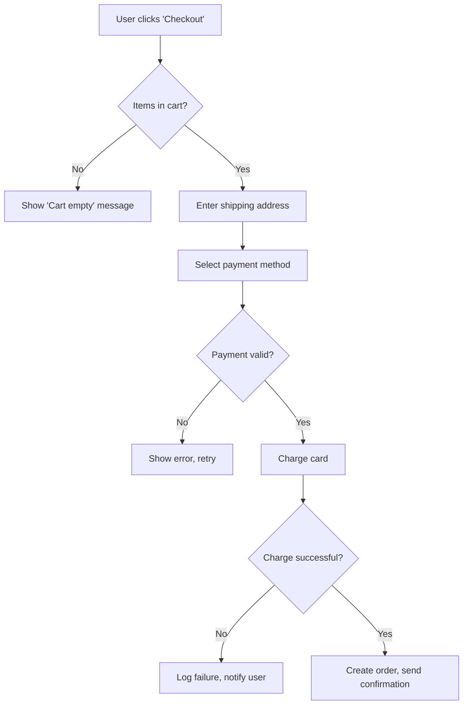

# Phase 3 PRD Rubric v1.0
**DevTeam.AI – Product Requirements Document Quality Standard**

## Purpose
This rubric defines the minimum quality threshold for a PRD to exit Phase 3 (Clarification Loop). The Clarifying PM Agent must enforce these criteria before allowing progression to Phase 4 (Parallel Planning Sprint).

**Enforcement**: If any Required criterion scores ❌, the Clarifying PM **rejects** the PRD and asks targeted follow-up questions. If 2+ Recommended criteria score ❌, the agent **warns** the user but may proceed with explicit acknowledgment.

---

## Section 1: Functional Requirements

### Required Criteria

#### ✅ R1.1: User Story Format
**Every feature follows the structure**: 
```
As a [specific role],
I want [concrete capability],
So that [measurable benefit or goal].
```

**Example - GOOD**:
```
As a course instructor,
I want to upload video files up to 2GB,
So that I can publish lecture content without external hosting.
```

**Example - BAD**:
```
Users should be able to upload videos.
```

**Clarifying PM Response to BAD**:
> "I need more specificity on the video upload feature. Please answer:
> 1. Who uploads videos? (instructor, student, admin?)
> 2. What's the maximum file size you need to support?
> 3. What's the user's goal? (publishing lessons, submitting assignments, creating marketing content?)"

---

#### ✅ R1.2: Testable Acceptance Criteria
**Every feature has 3-7 checkboxes** that can be verified by a QA agent without human interpretation.

**Format**:
```markdown
## Feature: User Authentication
**Acceptance Criteria**:
- [ ] User can register with email + password (8+ chars, 1 number, 1 special char)
- [ ] User can register with Google OAuth 2.0
- [ ] Email verification link expires after 24 hours
- [ ] Failed login attempts rate-limited to 5/hour per IP
- [ ] Password reset sends email with 1-hour expiry token
```

**BAD Examples (and why)**:
- ❌ "Login should be secure" (not testable – what does "secure" mean?)
- ❌ "Users can reset passwords" (how? email? SMS? security questions?)
- ❌ "System handles authentication" (who authenticates? against what?)

**Clarifying PM Response to BAD**:
> "Your authentication feature needs testable acceptance criteria. Please specify:
> 1. What authentication methods are supported? (email/password, OAuth, SSO, magic links?)
> 2. What are the password requirements? (length, complexity, expiration?)
> 3. How does password reset work? (email link, SMS code, security questions?)
> 4. What rate limiting or security measures are required?"

---

#### ✅ R1.3: Edge Cases Documented
**Each feature addresses at least 2 failure/edge scenarios**.

**Template**:
```markdown
## Feature: Payment Processing

**Happy Path**: User enters valid card → Stripe tokenizes → charge succeeds → order confirmed

**Edge Cases**:
1. **Card declined**: Show user-friendly error ("Payment failed. Please check your card details or try another card."), log to admin dashboard, send email to user with support link
2. **Network timeout during charge**: Implement idempotency key, poll Stripe for charge status for 30s, if unresolved show "Payment processing – check your email for confirmation"
3. **Duplicate submission**: Use order ID + timestamp hash as idempotency key, return existing order if duplicate detected within 5 minutes
```

**Clarifying PM Prompt**:
> "For each critical feature (auth, payment, data submission, file upload), describe:
> 1. What happens if the network fails mid-operation?
> 2. What happens if the user submits duplicate/malformed data?
> 3. What happens if a third-party service (Stripe, SendGrid, S3) is unavailable?"

---

### Recommended Criteria

#### ⚠️ R1.4: User Flow Diagrams (Recommended)
For complex features (3+ steps), include a Mermaid diagram showing state transitions.

**Example**:


**Why Recommended, Not Required**: Simple CRUD apps don't need diagrams. But for multi-step workflows (onboarding, checkout, multi-stage forms), diagrams prevent misunderstandings between agents.

---

#### ⚠️ R1.5: API Contract Specification (Recommended for Backend-Heavy Apps)
If the app has a backend API, specify key endpoints with request/response examples.

**Example**:
```yaml
POST /api/courses/:courseId/enroll
Headers:
  Authorization: Bearer {jwt_token}
Body:
  {
    "userId": "user_12345",
    "couponCode": "EARLY2025" // optional
  }
Response (200):
  {
    "enrollmentId": "enr_67890",
    "courseId": "course_12345",
    "status": "active",
    "expiresAt": "2026-01-15T00:00:00Z"
  }
Response (409):
  {
    "error": "User already enrolled in this course"
  }
```

**Why Recommended**: Prevents the Backend Agent and Frontend Agent from building incompatible interfaces. But for simple apps (static sites, single-page tools), this is overkill.

---

## Section 2: Non-Functional Requirements

### Required Criteria

#### ✅ R2.1: Performance Budgets
**Specify concrete thresholds** for page load, API response time, or critical operations.

**Minimum Specification**:
```markdown
## Performance Requirements
- **Page Load**: First Contentful Paint <1.5s on 4G (Lighthouse score >90)
- **API Response**: 95th percentile <500ms for read operations, <2s for writes
- **Search**: Results appear <300ms for queries <50 chars
- **File Upload**: Support files up to 100MB, show progress bar updating every 500ms
```

**BAD Examples**:
- ❌ "The app should be fast"
- ❌ "Good performance on modern browsers"

**Clarifying PM Follow-Up**:
> "I need specific performance targets. Please answer:
> 1. What's the maximum acceptable page load time? (1s, 3s, 5s?)
> 2. What network conditions must you support? (5G, 4G, 3G, 2G?)
> 3. Are there operations that can be slower? (exports, reports, batch processing?)
> 4. What's your target Lighthouse performance score? (70+, 90+, 95+?)"

---

#### ✅ R2.2: Security & Compliance Requirements
**Explicitly state**:
1. Authentication/authorization model
2. Data encryption requirements
3. Compliance standards (if any)
4. PII handling rules

**Template**:
```markdown
## Security & Compliance
- **Authentication**: JWT tokens with 15-minute expiry, refresh tokens valid 7 days, stored in httpOnly cookies
- **Authorization**: Role-based access control (roles: admin, instructor, student). Admins can access all courses; instructors can edit their own courses; students can view enrolled courses only.
- **Encryption**: All passwords hashed with bcrypt (cost factor 12). All data encrypted at rest (AES-256). TLS 1.3 for data in transit.
- **Compliance**: GDPR-compliant (EU users can request data export/deletion). WCAG 2.1 AA accessibility standard.
- **PII Handling**: Email, name, payment info are PII. Never log PII. Anonymize analytics data. Retain PII only while account is active + 30 days.
```

**Clarifying PM Prompt**:
> "Every app must address security. Please specify:
> 1. How do users authenticate? (session cookies, JWT, API keys?)
> 2. What data is considered sensitive? (passwords, payment info, health data, email?)
> 3. Do you have compliance requirements? (GDPR, HIPAA, SOC2, PCI-DSS?)
> 4. What's your data retention policy? (delete after 30 days, 1 year, never?)"

---

#### ✅ R2.3: Browser/Platform Support
**Define the supported matrix** so Frontend Agent knows what to target.

**Example**:
```markdown
## Platform Support
- **Browsers**: Chrome 90+, Firefox 88+, Safari 14+, Edge 90+ (Desktop)
- **Mobile**: iOS Safari 14+, Chrome Android 90+ (responsive design, no native app)
- **Screen Sizes**: 320px (mobile) to 2560px (desktop), breakpoints at 640px, 1024px, 1440px
- **Accessibility**: Keyboard navigation, screen reader support (NVDA, JAWS, VoiceOver tested)
```

**BAD Examples**:
- ❌ "Works on modern browsers"
- ❌ "Mobile-friendly"

---

### Recommended Criteria

#### ⚠️ R2.4: Scalability Targets (Recommended for SaaS/High-Traffic Apps)
If you expect growth, specify capacity requirements.

**Example**:
```markdown
## Scalability Requirements
- **Initial Launch**: Support 100 concurrent users, 1,000 daily active users
- **6-Month Target**: Support 1,000 concurrent users, 10,000 daily active users
- **Database**: Design schema to handle 1M records without performance degradation
- **Caching**: Implement Redis for session management and frequently accessed data (course catalogs, user profiles)
```

**Why Recommended**: For MVPs or internal tools with <100 users, premature optimization wastes time. But for SaaS apps, knowing scale targets informs architecture decisions (monolith vs. microservices, SQL vs. NoSQL).

---

## Section 3: Technical Constraints & Preferences

### Required Criteria

#### ✅ R3.1: Tech Stack Preferences (If Any)
**State explicit requirements or constraints**. If none, say "No constraints – architect decides."

**Example**:
```markdown
## Tech Stack Constraints
- **Frontend**: Must use React 18+ and Tailwind CSS (team familiarity)
- **Backend**: Must use Node.js with Express or Fastify (existing infrastructure)
- **Database**: Prefer PostgreSQL for relational data; Redis for caching/sessions
- **Hosting**: Must deploy to Vercel (frontend) and Railway (backend)
- **No-Gos**: No PHP, no MongoDB (bad past experience), no AWS (cost concerns)
```

**Alternate Example (No Constraints)**:
```markdown
## Tech Stack Constraints
No constraints. Solution Architect should choose based on:
- Best fit for requirements
- Long-term maintainability
- Cost efficiency
- Team learning goals (willing to try new tech)
```

---

#### ✅ R3.2: Dependencies & Integrations
**List all third-party services** the app must integrate with.

**Template**:
```markdown
## Required Integrations
1. **Stripe** (payments): Subscription billing with metered usage (process ~500 transactions/month)
2. **SendGrid** (email): Transactional emails (welcome, password reset, receipts). Must support HTML templates.
3. **Google OAuth** (auth): Social login. Must request email + profile scopes only.
4. **Cloudflare R2** (storage): Video file storage (replacing S3 for cost savings). Must support pre-signed URLs for secure downloads.

## Optional Integrations (Nice-to-Have)
- **Plausible Analytics**: Privacy-friendly analytics (add if budget allows)
- **Sentry**: Error tracking (add if QA agent recommends)
```

**Clarifying PM Prompt**:
> "What third-party services must this app integrate with? For each, specify:
> 1. Service name and purpose (e.g., 'Stripe for payments')
> 2. Expected usage volume (e.g., '1,000 emails/month')
> 3. Required features (e.g., 'Stripe must support subscriptions, not just one-time charges')
> 4. Authentication method (API key, OAuth, webhook?)"

---

### Recommended Criteria

#### ⚠️ R3.3: Architectural Preferences (Recommended for Opinionated Users)
If you have strong opinions on architecture patterns, state them.

**Example**:
```markdown
## Architectural Preferences
- **Monolith First**: Start with a single backend service. Only split into microservices if perf issues emerge.
- **API-First**: All frontend interactions via REST API (no server-side rendering). Design API assuming a mobile app might consume it later.
- **Database Migrations**: Use Prisma or TypeORM migration system – no raw SQL DDL.
- **File Storage**: Treat file uploads as separate concern – use cloud storage (R2/S3), never store in database.
```

**Why Recommended**: Most projects should defer to Solution Architect's judgment. But if you're an experienced engineer with strong opinions (or burned by past mistakes), declaring preferences upfront prevents architectural conflicts in Phase 4.

---

## Section 4: Acceptance Criteria Meta-Requirements

### ✅ R4.1: Definition of "Done" for MVP
**Clearly separate MVP scope from future phases**.

**Template**:
```markdown
## MVP Scope (Must-Have for Phase 12 Ship)
- User registration, login, password reset
- Course creation (title, description, video upload)
- Student enrollment and video playback
- Stripe payment integration for course purchases
- Basic admin dashboard (view users, courses, revenue)

## Post-MVP (Explicitly Out of Scope for Initial Ship)
- Live video streaming (MVP uses pre-recorded only)
- Discussion forums (will add in v1.1)
- Mobile app (MVP is web-only)
- Advanced analytics (MVP has basic metrics only)
```

**Why This Matters**: Prevents scope creep. Solution Architect can optimize for MVP requirements without over-engineering for future features.

---

### ✅ R4.2: Success Metrics
**Define how you'll measure if the app succeeded**.

**Example**:
```markdown
## Success Metrics
- **Technical Success**: App deployed to production, zero critical bugs in first 48 hours, Lighthouse score >90
- **User Success**: 10 beta users complete the full workflow (register → enroll → watch video → checkout) within first week
- **Business Success**: $500 in revenue within first month (proves payment flow works)

## Failure Criteria (When to Pivot/Abort)
- If >50% of beta users abandon at checkout, investigate UX/payment issues before adding features
- If video playback fails >10% of the time, halt new features and fix infrastructure
```

**Why This Matters**: Gives QA Agent and Delivery Summarizer concrete targets. Prevents "is it done?" ambiguity.

---

## Section 5: Red Flags (Auto-Reject Patterns)

The Clarifying PM Agent should **immediately reject** PRDs containing these patterns and educate the user:

### 🚫 RF1: Vague Success Criteria
**Examples**:
- "Make it intuitive"
- "Ensure good UX"
- "Optimize performance"
- "Make it scalable"

**Clarifying PM Response**:
> "I cannot proceed with vague criteria like 'make it intuitive.' Please provide testable metrics:
> - Instead of 'intuitive,' specify: 'New users complete onboarding in <3 minutes without help docs'
> - Instead of 'good UX,' specify: 'System Usability Scale (SUS) score >70 from beta testers'
> - Instead of 'optimize performance,' specify: 'Page load <2s on 4G'
> - Instead of 'make it scalable,' specify: 'Support 1,000 concurrent users without degradation'"

---

### 🚫 RF2: Ambiguous User Roles
**Example**:
"Users can create and edit documents."

**Problem**: Who is "users"? Admins? All logged-in users? Anonymous visitors?

**Clarifying PM Response**:
> "I need explicit user roles. Please define:
> 1. What roles exist in your system? (e.g., admin, editor, viewer, anonymous)
> 2. What can each role do? (use a permission matrix)
> 
> Example:
> | Action | Admin | Editor | Viewer | Anonymous |
> |--------|-------|--------|--------|-----------|
> | Create doc | ✅ | ✅ | ❌ | ❌ |
> | Edit doc | ✅ | ✅ (own only) | ❌ | ❌ |
> | Delete doc | ✅ | ❌ | ❌ | ❌ |
> | View doc | ✅ | ✅ | ✅ | ✅ (public docs only) |"

---

### 🚫 RF3: No Error Handling Specified
**Example**: A PRD describes happy path for file uploads but never mentions what happens if upload fails.

**Clarifying PM Response**:
> "Every critical feature must specify error handling. For file uploads, please answer:
> 1. What happens if file exceeds size limit? (show error? auto-compress?)
> 2. What happens if network fails mid-upload? (resume? restart? show progress?)
> 3. What happens if file type is unsupported? (block upload? convert?)
> 4. What happens if storage quota is exceeded? (prompt upgrade? delete old files?)"

---

### 🚫 RF4: "Build Something Like X" Without Specifics
**Example**: "Build a tool like Notion."

**Problem**: Notion has 100+ features. Which ones matter?

**Clarifying PM Response**:
> "I can't build 'something like Notion' without knowing which features you need. Please answer:
> 1. What are the 3-5 core features from Notion you want to replicate? (e.g., 'block-based editor, real-time collaboration, database views')
> 2. What features from Notion do you explicitly NOT need? (e.g., 'no AI writing assistant, no public sharing')
> 3. What features do you want that Notion doesn't have? (e.g., 'integrated invoicing')
> 
> This helps me scope your MVP instead of building a Notion clone."

---

## Section 6: Clarifying PM Agent Workflow

### Step-by-Step Process

#### Turn 1: Intake & Triage
**User provides initial idea** (e.g., "I want to build a course platform where instructors sell video lessons").

**Agent Response**:
```markdown
Great! I'll help you define this properly. I have 6 key questions to build a complete PRD:

**Question 1 (User Roles & Permissions)**:
Who are the users of this platform, and what can each role do?
- Example roles: Admin, Instructor, Student, Anonymous Visitor
- For each role, describe their key capabilities

(I'll ask about features, tech stack, performance, and more in follow-ups)
```

---

#### Turn 2-5: Deep Dive (One Topic Per Turn)
**Agent asks focused questions** on:
1. User roles & permissions
2. Core features & acceptance criteria
3. Non-functional requirements (performance, security)
4. Tech stack preferences & integrations
5. MVP scope vs. future phases

**Example Turn 3 (Features)**:
```markdown
**Question 3 (Core Features)**:
You mentioned video lessons. Let's define this feature precisely:

1. **Upload**: 
   - Max file size? (100MB, 1GB, 5GB?)
   - Supported formats? (MP4 only, or also MOV, AVI, WebM?)
   - Where stored? (Your server, S3, Cloudflare R2, Vimeo?)

2. **Playback**:
   - Quality options? (auto, 720p, 1080p, 4K?)
   - Speed controls? (0.5x, 1x, 1.5x, 2x?)
   - Subtitles/captions? (uploaded separately, auto-generated, or no support?)

3. **Access Control**:
   - Who can watch? (only enrolled students, or anyone with link?)
   - DRM/protection? (prevent downloads, or allow?)

Please provide specific answers for each.
```

---

#### Turn 6: Rubric Validation & PRD Generation
**Agent generates draft PRD** and self-scores against this rubric:

```markdown
I've compiled your answers into a PRD. Let me validate it against our quality rubric:

✅ R1.1: User stories in correct format
✅ R1.2: Testable acceptance criteria (32 checkboxes across 8 features)
⚠️  R1.3: Edge cases documented for 6/8 features (missing: video playback failure, payment webhook retry)
✅ R2.1: Performance budgets specified
✅ R2.2: Security requirements detailed
✅ R2.3: Browser support matrix provided
✅ R3.1: Tech stack preferences noted
✅ R3.2: Integrations listed (Stripe, Vimeo, SendGrid)
✅ R4.1: MVP scope clearly separated from v1.1 features

**Issues to Address**:
I'm missing edge case handling for:
1. What happens if Vimeo video processing fails after upload?
2. What happens if Stripe webhook is delayed/lost during payment?

Should I ask follow-up questions, or would you like to specify these now?
```

---

#### Turn 7 (If Needed): Gap Filling
**Agent asks targeted follow-ups** only for rubric gaps.

**If user declines**: Agent warns and proceeds:
```markdown
Understood. I'll proceed with the assumption that:
- Video playback failures show generic error + retry button (no special handling)
- Stripe webhook retries are handled by Stripe's default behavior (up to 3 days of retries)

The Solution Architect may recommend more robust handling in Phase 4. You can override at that point.

**PRD is now complete and approved for Phase 4.**
```

---

## Section 7: PRD Template (Output Format)

**The Clarifying PM Agent must output the final PRD in this exact structure**:

```markdown
# Product Requirements Document
**Project**: [Name]
**Owner**: [User's name or identifier]
**Created**: [Date]
**Last Updated**: [Date]
**Status**: ✅ Approved for Phase 4

---

## 1. Vision & Goals
[2-3 sentence summary of what this app does and why it exists]

**Success Metrics**:
- [Technical success criteria]
- [User success criteria]
- [Business success criteria (if applicable)]

---

## 2. User Roles & Permissions
| Role | Description | Key Capabilities |
|------|-------------|------------------|
| [Role 1] | [Who they are] | [What they can do] |
| [Role 2] | [Who they are] | [What they can do] |

---

## 3. Functional Requirements

### Feature 1: [Name]
**User Story**: As a [role], I want [capability], so that [benefit].

**Acceptance Criteria**:
- [ ] [Testable criterion 1]
- [ ] [Testable criterion 2]
- [ ] [Testable criterion 3]

**Edge Cases**:
1. [Scenario]: [How system handles it]
2. [Scenario]: [How system handles it]

---

### Feature 2: [Name]
[Repeat structure]

---

## 4. Non-Functional Requirements

### Performance
- [Specific threshold 1]
- [Specific threshold 2]

### Security & Compliance
- [Authentication model]
- [Encryption requirements]
- [Compliance standards]

### Browser/Platform Support
- [Browser matrix]
- [Device support]
- [Accessibility standards]

---

## 5. Technical Constraints

### Tech Stack Preferences
- **Frontend**: [Requirements or "No constraints"]
- **Backend**: [Requirements or "No constraints"]
- **Database**: [Requirements or "No constraints"]
- **Hosting**: [Requirements or "No constraints"]

### Required Integrations
1. **[Service Name]**: [Purpose, usage volume, key requirements]
2. **[Service Name]**: [Purpose, usage volume, key requirements]

---

## 6. MVP Scope

### In Scope (Must Ship)
- [Feature 1]
- [Feature 2]
- [Feature 3]

### Out of Scope (Post-MVP)
- [Feature A] – deferred to v1.1
- [Feature B] – deferred to v1.2

---

## 7. Open Questions / Decisions Needed
- [Question 1] – defer to Solution Architect
- [Question 2] – defer to UI/UX Designer

---

## 8. Appendix

### Mermaid Diagrams (If Applicable)
[User flow diagrams]

### API Contracts (If Applicable)
[Key endpoint specifications]

---

**Rubric Self-Score**:
Required Criteria: [X/Y] passed
Recommended Criteria: [X/Y] passed
Red Flags: [None detected / Issues resolved]

**Approved By**: [User confirmation timestamp]
**Ready for Phase 4**: ✅ Yes
```

---

## Section 8: Training Examples for Clarifying PM Agent

### Example 1: Good PRD (Passes Rubric)

**User Idea**: "Build a task management app for small teams."

**After 6 Questions, PRD Includes**:

```markdown
### Feature: Task Creation
**User Story**: As a team member, I want to create tasks with title, description, due date, and assignee, so that I can delegate work clearly.

**Acceptance Criteria**:
- [ ] Task form has fields: title (required, max 100 chars), description (optional, rich text), due date (optional, date picker), assignee (dropdown of team members)
- [ ] Clicking "Create" saves task to database and shows in assignee's task list within 2 seconds
- [ ] Assignee receives email notification within 5 minutes (via SendGrid)
- [ ] If due date is past, show red "Overdue" badge on task card
- [ ] Tasks are sorted by due date (ascending) in default view

**Edge Cases**:
1. **Network failure during save**: Show toast "Failed to create task. Retry?" with retry button. If retry succeeds, task appears in list without duplicate.
2. **Assignee deleted after task created**: Task shows "Unassigned" and highlights in yellow. Admin can reassign.
```

**Why This Passes**:
- ✅ User story format correct
- ✅ 5 testable acceptance criteria
- ✅ 2 edge cases with clear handling
- ✅ Implicit performance requirement ("within 2 seconds")

---

### Example 2: Bad PRD (Fails Rubric)

**User Idea**: "Build a social network for dog owners."

**Attempted PRD**:

```markdown
### Feature: User Profiles
Users should be able to create profiles for their dogs with pictures and information. The profile should look nice and be easy to edit.
```

**Why This Fails**:
- ❌ No user story format
- ❌ "Look nice" and "easy to edit" are not testable
- ❌ No acceptance criteria checkboxes
- ❌ No edge cases

**Clarifying PM Response**:
```markdown
This feature description is too vague. I need specific answers:

1. **Profile Fields**: What information is required vs. optional?
   - Example: Dog name (required), breed (optional), age (required), bio (optional, max 500 chars)

2. **Picture Upload**: 
   - How many pictures allowed per profile? (1 main + 5 gallery, or unlimited?)
   - Max file size? (5MB, 10MB?)
   - Allowed formats? (JPG, PNG, WebP, HEIC?)

3. **Editing Rules**:
   - Can anyone edit any profile, or only the owner?
   - Is there an approval process for edits?

4. **Testable Success**:
   - Instead of "look nice," specify: "Profile page achieves Lighthouse accessibility score >90"
   - Instead of "easy to edit," specify: "Users can update profile in <30 seconds (measured via analytics)"

Please provide concrete answers, and I'll generate proper acceptance criteria.
```

---

### Example 3: Handling Ambiguity (User Refuses to Specify)

**User**: "Just make it work like Instagram but for books."

**Clarifying PM Response**:
```markdown
Instagram has 50+ features (stories, reels, DMs, explore, shopping, ads, etc.). I can't build all of that, so I need you to prioritize.

Here's a starter checklist. Please pick your TOP 5:
- [ ] User profiles (bio, avatar, follower count)
- [ ] Photo/video posts with captions and hashtags
- [ ] Like and comment on posts
- [ ] Follow/unfollow other users
- [ ] Feed algorithm (chronological, or personalized?)
- [ ] Direct messaging
- [ ] Stories (24-hour ephemeral posts)
- [ ] Explore page (discover new content)
- [ ] Push notifications
- [ ] In-app purchases or ads

Once you pick 5, I'll ask detailed questions about each to build a proper PRD.

If you want ALL of these, I'll need to split into phases (MVP = 5 features, v1.1 = next 3, etc.).
```

**Why This Works**: Forces user to make trade-offs. Most will realize they don't need everything and prioritize.

---

## Section 9: Integration with Phase 4 (Handoff to Solution Architect)

Once the PRD passes this rubric, the Clarifying PM Agent outputs:

```markdown
✅ **PRD Approved – Ready for Phase 4**

**Summary Stats**:
- 12 functional requirements defined
- 47 acceptance criteria checkboxes created
- 8 edge cases documented
- 0 red flags detected
- User confirmed approval at [timestamp]

**Handoff to Solution Architect**:
The following decisions are explicitly deferred to you:
1. Database choice (user has no preference – optimize for cost + performance)
2. Video hosting (user mentioned Vimeo but is open to alternatives if you find better pricing)
3. Caching strategy (user didn't specify – recommend based on expected load)

**Handoff to UI/UX Designer**:
User prefers "clean, modern, Tailwind-based design" but has no mockups. Use your judgment.

**Handoff to Tech Lead**:
MVP scope includes 12 features. Estimated complexity: Medium. Suggest 3 parallel tracks:
1. Auth + user management (Backend + Frontend)
2. Video upload + playback (Backend + DevOps + Frontend)
3. Payment integration (Backend + Frontend)

**BudgetGuard Alert**:
User set budget cap at $200. Based on PRD complexity, estimated LLM cost: $120-$180 (within budget).
```

This handoff ensures Phase 4 agents have everything they need without redundant clarification loops.

---

## Changelog

**v1.0** (Dec 2025):
- Initial rubric based on DevTeam.AI Phase 3 requirements
- 15 criteria (9 required, 6 recommended)
- 4 red flag patterns with auto-reject logic
- PRD template and training examples included

---

**End of Rubric**